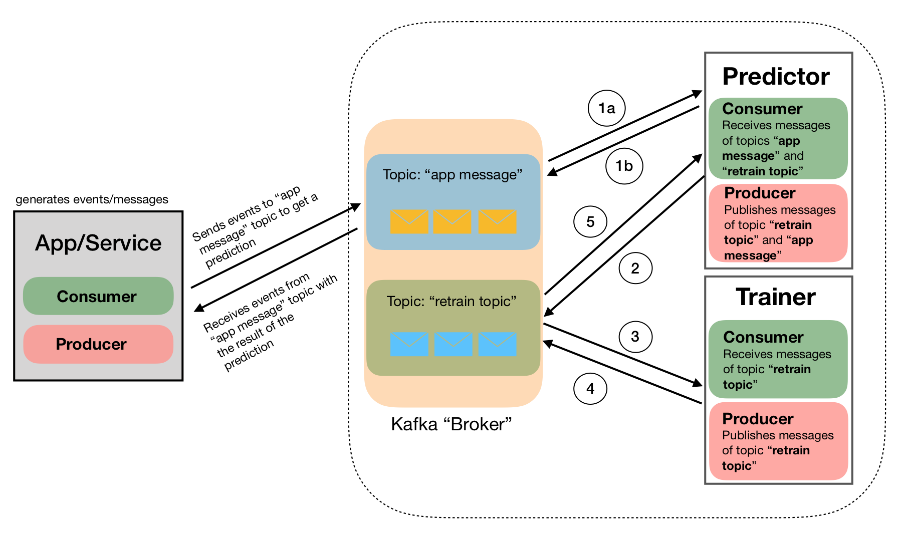

# Putting ML to Production
This repo contains code that we hope is useful to illustrate how one could productionise a real-time algorithm. The companion Medium post can be found here. The code here is meant to be as generic as possible (within certain limits), and is designed to be useful for the following scenario.

## Scenario

A company collects data using a series of services that generate events as the users/customers interact with the the company's website or app. As these interactions happen, an algorithm needs to run in real time and some immediate action needs to be taken based on the algorithm's outputs (or predictions). On top of that, after N interactions (or observations) the algorithm needs to be retrained without stopping the prediction service.

For the exercise here we have used the [Adult](https://archive.ics.uci.edu/ml/datasets/adult) dataset, where the goal is to predict whether individuals earn an income higher/lower than 50k based on their age, native country, etc. To adapt this dataset our scenario we describe here, one could assume that that information (age, native country, etc) is collected through an online questionnaire and we need to predict whether that individual is high/low income in real time. If high income, then we immediately call/email them with some offer, for example.

## Solution

Our solution is illustrated in the figure below, and uses mainly [Kafka-Python](https://github.com/dpkp/kafka-python), [LightGBM](https://lightgbm.readthedocs.io/en/latest/#) and [Hyperopt](http://hyperopt.github.io/hyperopt/) or [HyperparameterHunter](https://github.com/HunterMcGushion/hyperparameter_hunter).

 A full description of the solution can be found in this medium post. Briefly:

**OFFLINE**

The "offline" process is all accomplished by running the `initialize.py` script. This script will download the dataset, set the dir structure, pre-preprocess the data, train an initial model on the training dataset and optimise the hyperparameters of that model. The results will be saved to disk and from there on we are ready to move to the online stage of the process.

**ONLINE**

 0. The App/Service (`app_sample.py`) will send messages (JSON) into the pipeline. These will be processed and App/Service will then get the results of the predictions.
 1. 1a) The messages from App/Service will be received by the Predictor (`predictor.py`)

 	1b) The Predictor will process the data and run the algorithm publishing the result, which will be eventually received by App/Service
 2. After N message the Predictor will publish a "retrain topic" message
 3. The Trainer (`trainer.py`) will receive the "retrain" message and start retraining the algorithm. In the meantime, the Predictor will not stop serving predictions.
 4. Once the algorithm is retrained, the Trainer will publish a message with the corresponding information (namely: *"retraining completed"*)
 5. The Predictor will receive the message that retraining is complete, it will load the new model and proceed as usual.

## How to run the pipeline

As we mentioned before, the first script that needs to run is `initialize.py`. As mentioned before, to train the algorithm and optimize the hyperparameters we have used LightGBM along with Hyperopt or HyperparameterHunter. The later is built on top of Skopt. It is not our goal here to compare hyperparameter optimization packages. Nonetheless, a brief comparison is included in the medium post and a notebook comparing Skopt and Hyperopt performances is included here.

After running `initialize.py` one simply needs to run `sample_app.py`, `predictor.py` and `trainer.py`, as shown in the GIF below.

After `RETRAIN_EVERY` messages (parameter to be set by the user), the user will be able to see how the algorithm is retrained while the prediction process does not stop.

## Next Steps

In the following weeks/months we will include logging and monitoring using MLFLow as well flow management using Sagemaker.

For more detailed information please read the companion Medium post.